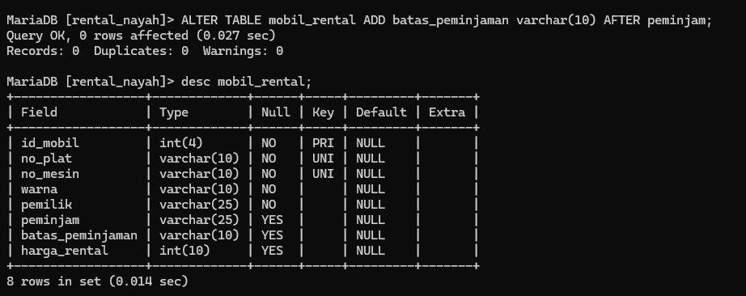

LINK WEB  https://www.techonthenet.com/mysql/tables/alter_table.php
SEBELUM DIUBAH
![[Screenshot46 1.png]]
# Menambahkan Kolom
## Struktur Query 
```MYSQL
alter table nama_tabel add nama_kolom varchar(10) after nama_kolom;
```

```mysql
	ALTER TABLE mobil_rental ADD batas_peminjaman varchar(10) AFTER peminjam;
```

## Hasil

## Analisis
- `ALTER TABLE mobil_rental`: Ini adalah perintah utama yang menyatakan bahwa Anda ingin mengubah struktur tabel bernama `mobil_rental`.
- `ADD batas_peminjaman varchar(10)`: Ini menunjukkan bahwa Anda ingin menambahkan kolom baru ke tabel. Kolom baru ini bernama `batas_peminjaman` dan memiliki tipe data `varchar(10)`, yang berarti kolom tersebut akan berisi teks dengan panjang maksimum 10 karakter.
- `AFTER peminjam`: Bagian ini menentukan posisi di mana kolom baru akan ditambahkan. Dalam hal ini, kolom baru (`batas_peminjaman`) akan ditempatkan setelah kolom `peminjam`.
- `AFTER` opsional digunakan,jika tidak menggunakan klausa ini maka secara default kolom yang dibuat akan berada diakhir . jika kolom ingin ditaruh pada awal kolom maka gunakan klausa `FIRST`
## Kesimpulan
Perintah `ALTER TABLE mobil_rental ADD batas_peminjaman varchar(10) AFTER peminjam;` digunakan untuk menambahkan kolom baru bernama `batas_peminjaman` ke dalam tabel `mobil_rental`. Kolom baru ini memiliki tipe data `varchar(10)`, yang berarti dapat menyimpan teks dengan panjang maksimum 10 karakter. Kolom baru ini akan ditempatkan setelah kolom `peminjam` dalam struktur tabel. Dengan demikian, perintah ini secara efektif mengubah struktur tabel dengan menambahkan informasi baru terkait dengan batas peminjaman mobil di dalamnya.

## TAMBAHAN "Update"
### Struktur Query
```mysql
 update nama_tabel set nama_kolom= "nama_data" where nama_kolom is not null;
```

```mysql
 update mobil_rental set batas_peminjaman= "2024-04-24" where peminjam is not null;
```

### Hasil
![[Screenshot48.png]]

# Mengubah Nama kolom
## Struktur Query
```mysql
alter table nama_tabel change nama_kolom nama_kolom_baru tipe_datanya;
```

```mysql
	ALTER TABLE mobil_rental CHANGE batas_peminjaman deadline varchar(10);
```

## Hasil
![[Screenshot49.png]]
## Analisis
- `ALTER TABLE mobil_rental`: Ini adalah perintah utama yang menyatakan bahwa Anda ingin mengubah struktur tabel bernama `mobil_rental`.
- `CHANGE batas_peminjaman deadline varchar(10)`: Ini adalah bagian yang sebenarnya dari perintah yang menentukan perubahan yang ingin Anda lakukan. Dalam hal ini:
    - `batas_peminjaman` adalah nama kolom yang akan diubah.
    - `deadline` adalah nama baru yang akan diberikan kepada kolom tersebut.
    - `varchar(10)` menunjukkan bahwa tipe data kolom tersebut akan diubah menjadi `varchar` dengan panjang maksimum 10 karakter.
## Kesimpulan
Perintah `ALTER TABLE mobil_rental CHANGE batas_peminjaman deadline varchar(10);` mengubah struktur tabel `mobil_rental` dengan mengganti nama kolom `batas_peminjaman` menjadi `deadline` dan mengubah tipe datanya menjadi `varchar(10)`.

# Mengubah tipe data kolom
## Struktur Query
```mysql
alter table nama_tabel modify nama_kolom date;
```

```mysql
alter table mobil_rental modify deadline DATE;
```

## Hasil
![[Screenshot50.png]]
## Analisis
- `ALTER TABLE mobil_rental`: Ini adalah perintah utama yang menyatakan bahwa Anda ingin mengubah struktur tabel bernama `mobil_rental`.
- `MODIFY deadline DATE`: Ini adalah bagian yang menentukan perubahan yang ingin Anda lakukan. Dalam hal ini:
    - `deadline` adalah nama kolom yang akan dimodifikasi.
    - `DATE` adalah tipe data baru yang diberikan kepada kolom tersebut. Dalam hal ini, kolom `deadline` akan diubah menjadi tipe data tanggal (`DATE`).
## Kesimpulan
Perintah `ALTER TABLE mobil_rental MODIFY deadline DATE;` mengubah tipe data kolom `deadline` dalam tabel `mobil_rental` menjadi tipe data `DATE`.
# Menambahkan constrain 
LINK WEB https://revou.co/panduan-teknis/sql-constraint
## Struktur Query
```mysql
alter table nama_tabel
	alter nama_kolom set default 'nilai_default' ;
```

```mysql
ALTER TABLE mobil_rental
    -> ALTER deadline SET DEFAULT 'Ready';
```

## Hasil
![[Screenshot51.png]]
## Analisis
- `ALTER TABLE mobil_rental`: Ini adalah perintah utama yang menyatakan bahwa Anda ingin mengubah struktur tabel bernama `mobil_rental`.
- `ALTER deadline SET DEFAULT 'Ready'`: Ini adalah bagian yang menentukan perubahan yang ingin Anda lakukan pada kolom `deadline`. Dalam hal ini:
    - `deadline` adalah nama kolom yang akan dimodifikasi.
    - `SET DEFAULT 'Ready'` menunjukkan bahwa nilai default 'Ready' akan ditetapkan untuk kolom `deadline`. Ini berarti ketika baris baru ditambahkan ke tabel dan nilai `deadline` tidak disediakan, maka nilai default 'Ready' akan otomatis diterapkan.
## Kesimpulan
Perintah `ALTER TABLE mobil_rental ALTER deadline SET DEFAULT 'Ready';` menetapkan nilai default 'Ready' untuk kolom `deadline` dalam tabel `mobil_rental`.
Dengan ini, jika sebuah baris baru dimasukkan ke dalam tabel dan nilai `deadline` tidak disediakan, nilai default 'Ready' akan secara otomatis diterapkan untuk kolom `deadline`.
Jadi, perintah ini secara efektif mengubah perilaku tabel dengan menambahkan nilai default untuk kolom `deadline`.
## Tambahan
### Struktur Query
```mysql
insert into mobil_rental
    -> (id_mobil,no_plat,no_mesin,warna,pemilik,peminjam,harga_rental)
    -> values (7,"DD 2442 CY","ATSY66","Hijau","Nay",NULL,'300000');
```
### Hasil
![[Screenshot52.png]]
# Menghapus kolom
LINK WEB file:///C:/Users/ASUS/Downloads/SELECT%20LANJUTAN-1.pdf
## Struktur Query
```mysql
alter table nama_tabel drop column nama_kolom;
```

```mysql

MariaDB [rental_nayah]> ALTER TABLE mobil_rental
ALTER deadline DROP DEFAULT;
```

```mysql
ALTER TABLE mobil_rental DROP COLUMN deadline;
```
## Hasil
![[Screenshot53.png]]
![[Screenshot54.png]]
## Analisis
- `ALTER TABLE mobil_rental`: Ini adalah perintah utama yang menyatakan bahwa Anda ingin mengubah struktur tabel bernama `mobil_rental`.
- `ALTER deadline DROP DEFAULT`: Ini adalah bagian yang menentukan perubahan yang ingin Anda lakukan pada kolom `deadline`. Dalam hal ini:
    - `deadline` adalah nama kolom yang akan dimodifikasi.
    - `DROP DEFAULT` menunjukkan bahwa nilai default yang sebelumnya ditetapkan untuk kolom `deadline` akan dihapus. Ini berarti ketika baris baru dimasukkan ke dalam tabel, tidak akan ada nilai default yang otomatis diterapkan untuk kolom `deadline`.
## Kesimpulan
Perintah `ALTER TABLE mobil_rental ALTER deadline DROP DEFAULT;` digunakan untuk menghapus nilai default yang sebelumnya ditetapkan untuk kolom `deadline` dalam tabel `mobil_rental`.

Dengan melakukan ini, Anda menghapus pengaturan default untuk kolom `deadline`, yang berarti ketika baris baru dimasukkan ke dalam tabel, tidak akan ada nilai default yang otomatis diterapkan untuk kolom `deadline`.

Jadi, perintah ini mengubah perilaku tabel dengan menghapus nilai default untuk kolom `deadline`.

# Mengganti nama tabel
## Struktur Query
```mysql
alter table mobil rename to data_mobil ;
```

```mysql
alter table mobi_rental rename to daftar_mobil;
```

## Hasil
![[Screenshot55.png]]
## Analisis
- `ALTER TABLE mobil_rental`: Ini adalah perintah utama yang menyatakan bahwa Anda ingin mengubah struktur tabel dengan nama `mobil_rental`.
- `RENAME TO daftar_mobil`: Ini adalah bagian yang menentukan perubahan yang ingin Anda lakukan pada nama tabel. Dalam hal ini:
    - `RENAME TO` menunjukkan bahwa Anda ingin mengganti nama tabel.
    - `daftar_mobil` adalah nama baru yang akan diberikan kepada tabel tersebut.
## Kesimpulan
Perintah `ALTER TABLE mobil_rental RENAME TO daftar_mobil;` digunakan untuk mengubah nama tabel `mobil_rental` menjadi `daftar_mobil`.

Dengan melakukan ini, Anda secara efektif mengubah identitas tabel di dalam database dari `mobil_rental` menjadi `daftar_mobil`.

 
